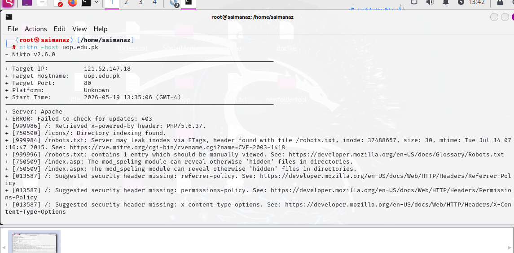

# Nikto Vulnerability Scan Report

This repository contains the results and analysis of a web server vulnerability scan performed using **Nikto v2.6.0**.

---

##  Target Information

| Parameter | Value |
| :--- | :--- |
| **Target Host** | `uop.edu.pk` |
| **Target IP** | `121.52.147.18` |
| **Target Port** | `80` (HTTP) |
| **Web Server** | Apache |
| **Scan Timestamp** | 2026-05-19 13:35:06 (GMT-4) |

---

##  Scan Findings & Analysis

### 1. Outdated Backend Software (PHP 5.6)
* **Nikto ID:** `[999986]`
* **Log Entry:** `/: Retrieved x-powered-by header: PHP/5.6.37.`
* **Description:** The server explicitly broadcasts that it is running PHP version 5.6.37. 
* **Security Risk:** PHP 5.6 reached its official **End of Life (EOL)** several years ago. It no longer receives security patches, meaning it likely contains unpatched, publicly known vulnerabilities that attackers can exploit.

### 2. Directory Indexing Enabled
* **Nikto ID:** `[750500]`
* **Log Entry:** `/icons/: Directory indexing found.`
* **Description:** The `/icons/` directory is misconfigured to allow public directory listing.
* **Security Risk:** If a user navigates to this URL, the server will display a raw list of all files inside the folder (like a file explorer) rather than a web page. This exposes the internal file structure of the web server.

### 3. File System Inode Leak
* **Nikto ID:** `[999984]`
* **Log Entry:** `/robots.txt: Server may leak inodes via ETags, header found with file /robots.txt, inode: 37488657`
* **CVE Reference:** [CVE-2003-1418](https://cve.mitre.org/cgi-bin/cvename.cgi?name=CVE-2003-1418)
* **Description:** The Apache server includes file system "inodes" (internal system identification numbers) inside the HTTP ETag response headers.
* **Security Risk:** Low. However, it allows an attacker to gather minor intelligence about the host's underlying file system structure and file modification times.

### 4. URL Guessing via `mod_speling`
* **Nikto ID:** `[750509]`
* **Log Entry:** `/index.asp (and /index.aspx): The mod_speling module can reveal otherwise 'hidden' files in directories.`
* **Description:** The server is utilizing the Apache module `mod_speling`, which attempts to automatically correct minor spelling or capitalization errors in URLs requested by users.
* **Security Risk:** Attackers can abuse this feature to systematically guess and discover hidden files or directories that are not intended to be public.

---

## Missing Security Headers

Nikto flagged **three missing HTTP headers** (`[013587]`). These headers are crucial for modern browser-side defense.

1. **`Referrer-Policy`**
   * **Risk:** Without this header, when a user clicks a link taking them away from this website, the full URL (which might contain sensitive session tokens or parameters) could be leaked to the destination website.
2. **`Permissions-Policy`**
   * **Risk:** This header restricts which browser features (like the webcam, microphone, or geolocation) the web page is allowed to access. Missing it leaves the site open to broader browser-level exploits.
3. **`X-Content-Type-Options`**
   * **Risk:** Missing the `nosniff` directive allows a browser to guess the file type (MIME-sniffing). An attacker could exploit this by uploading a malicious script disguised as a harmless text or image file, which the browser might execute anyway.

---

## Remediation Recommendations

To harden this server based on the Nikto output, the following steps should be taken:

1. **Upgrade PHP:** Migrate the backend environment from the obsolete PHP 5.6 to a modern, supported version (such as PHP 8.x).
2. **Disable Directory Browsing:** Modify the Apache configuration file (`httpd.conf` or `.htaccess`) to remove directory listings:
   ```apache
   Options -Indexes
---
Disable URL Guessing: Turn off the spelling module if it is not business-critical:
apachee
CheckSpelling Off
Implement Security Headers: Add the missing headers to the server's configuration to protect users' browsers:
Apache
Header set X-Content-Type-Options "nosniff"
Header set Referrer-Policy "strict-origin-when-cross-origin"
Header set Permissions-Policy "geolocation=(), microphone=(), camera=()"
---

