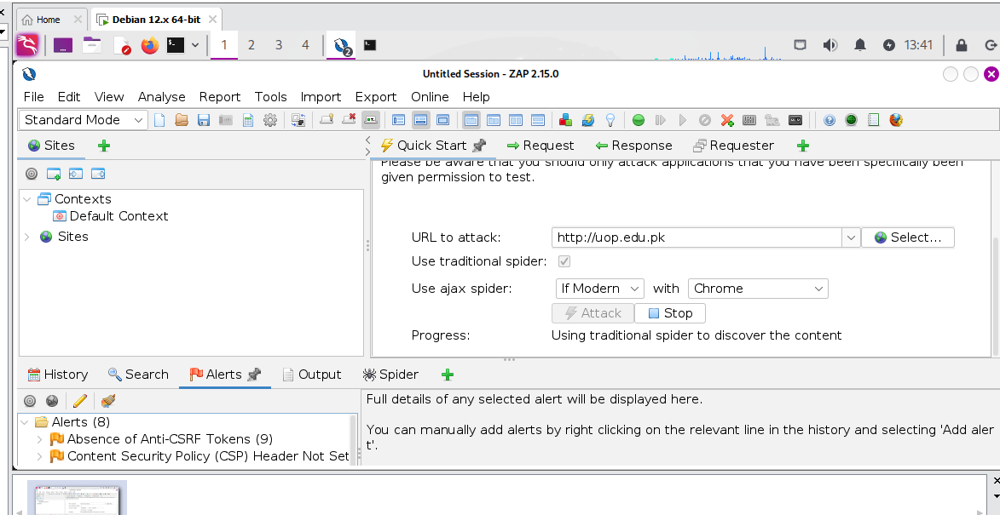

# OWASP ZAP Scan Report Summary

This section details the preliminary findings from a web application security scan conducted using **OWASP ZAP v2.15.0**.

---

## 🎯 Target Information

| Parameter | Value |
| :--- | :--- |
| **Target URL** | `http://uop.edu.pk` |
| **Scan Mode** | Standard Mode |
| **Active Tool** | Traditional Spider (Discovering Content) |
| **Total Alerts Found So Far** | 8 |

---

## 🔍 Initial Alert Analysis

OWASP ZAP categorizes vulnerabilities using colored flags. The orange flags shown in the screenshot indicate **Medium-risk** or **Low-risk/Info** configuration issues that should be addressed to harden the application.

### 1. Absence of Anti-CSRF Tokens
* **Alert Count:** 9 instances found.
* **Description:** ZAP detected HTML forms on the website that do not utilize unique, unpredictable tokens to validate form submissions.
* **Security Risk:** Without Cross-Site Request Forgery (CSRF) tokens, an attacker could potentially trick an authenticated user into unknowingly submitting unauthorized commands or data to the web application (e.g., modifying account details or submitting data via an external malicious link).

### 2. Content Security Policy (CSP) Header Not Set
* **Description:** The web server does not send a `Content-Security-Policy` HTTP response header.
* **Security Risk:** CSP is a powerful layer of defense that tells the browser exactly which scripts, images, and styles are trusted to execute on the page. Without a CSP header, the application is significantly more vulnerable to **Cross-Site Scripting (XSS)** and data injection attacks, as the browser will implicitly trust and execute any script injected by a malicious party.

---

## 🛡️ Defensive Remediation Recommendations

To resolve these initial warnings flagged by OWASP ZAP:

1. **Implement Anti-CSRF Protection:** Ensure all state-changing HTTP requests (like `POST` requests for logging in, submitting forms, or changing settings) include a cryptographically secure, random token that is validated on the server side before processing.
2. **Configure a Content Security Policy (CSP):** Define a robust CSP header in the Apache configuration or application source code. For example, a basic starting policy might look like:
   ```http
   Content-Security-Policy: default-src 'self'; script-src 'self' [https://trustedscripts.com](https://trustedscripts.com);
   


   
